# EfficientDet-Japanese-RoadSigns
Training and detection Japanese RoadSigns by EfficientDet

<h2>
EfficientDet Japanese RoadSigns (Updated: 2021/11/25)
</h2>

This is a simple python example to train and detect Japanese RoadSigns by EfficientDet of Google Brain AutoML.

<h3>
1. Installing tensorflow on Windows10
</h3>
We use Python 3.8 to run tensoflow 2.4.0 on Windows10. 
At first, you have to install Microsoft Visual Studio 2019 Community Edition for Windows10. 
We create and use "c:\google" folder for our project. 
<pre>
>mkdir c:\google
>cd    c:\google
>pip install - requirements.tx
>git clone https://github.com/cocodataset/cocoapi
>cd cocoapi/PythonAPI
</pre>
You have to modify extra_compiler_args in setup.py in the following way: 
   extra_compile_args=[],
<pre>
>python setup.py build_ext install
</pre>

 
 
<h3>
2. Installing EfficientDet-Japanese-RoadSigns
</h3>
We have merged our <b>EfficientDet-Japanese-RoadSigns</b> repository with <b>efficientdet</b> in 
<a href="https://github.com/google/automl">Google Brain AutoML</a> on 2021/09/12. 
Please clone EfficientDet-Japanese-RoadSigns in the working folder <b>c:\google</b>. 
<pre>
>git clone  https://github.com/atlan-antillia/EfficientDet-Japanese-RoadSigns.git 
</pre>
You can see the following folder <b>projects</b> in  EfficientDet-Japanese-RoadSigns folder of the working folder. 

<pre>
EfficientDet-Japanese-RoadSigns
└─projects
    ├─coco
    │  └─configs
    └─Japanese_RoadSigns
        ├─configs
        ├─outputs
        ├─saved_model
        │  └─variables
        ├─test
        ├─train
        ├─valid
        └─__pycache__
</pre>
 
<b>Note:</b> 
 The Japanese_RoadSigns tfrecord in train and valid is created from the 
 <a href="https://github.com/atlan-antillia/YOLO_Annotated_Japanese_Roadsigns">YOLO_Annotated_Japanese_RoadSigns</a>
 However, the all images in the YOLO repository was resized to become 512x512 to create those japanese_roadsigns.tfrecords. 
 
 See also: <a href="https://github.com/atlan-antillia/YOLO_Annotated_Japanese_Roadsigns_512x512">YOLO_Annotated_Japanese_Roadsigns_512x512</a>
  
 

<h3>3. Inspect tfrecord</h3>
  If you would like to inspect tfrecord, you can use   
<a href="https://github.com/jschw/tfrecord-view">tfrecord_view_gui.py</a>, or 
<a href="https://github.com/EricThomson/tfrecord-view">view_tfrecord_tf2.py</a>.
 
  We have created <a href="./TFRecordInspector.py">TFRecordInspector.py</a> 
from the original <i>view_tfrecord_tf2.py</i> to be able 
to read a tfrecord file and label_map.pbtxt file on the command line. 
Run the following command to inspect train.tfreord. 
<pre>
>python TFRecordInspector.py ./projects/Japanese_RoadSigns/train/japanese_roadsigns.tfrecord ./projects/Japanese_RoadSigns/train/label_map.pbtxt ./inspector/train
</pre>
 
 
<b>TFRecordInspecotr: annotated images in train.tfrecord</b> 
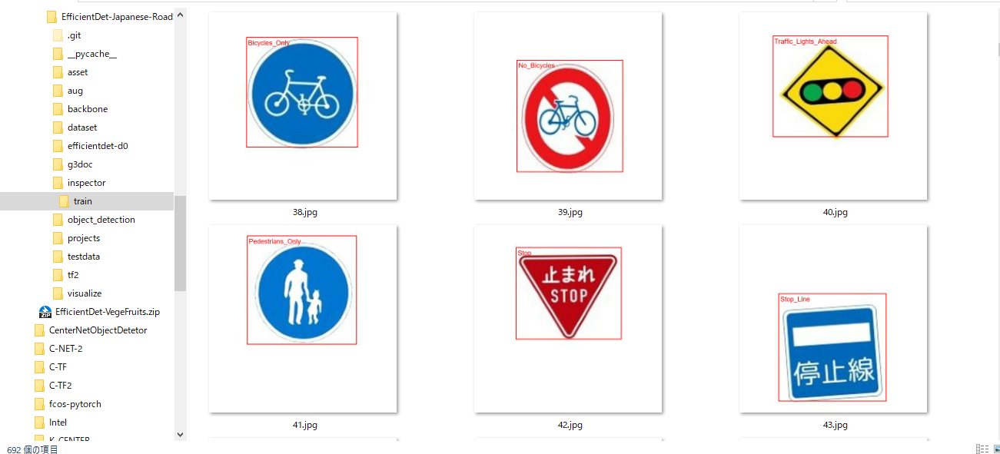
 
 
<b>TFRecordInspecotr: objects_count train.tfrecord</b> 

 
 
<h3>4. Downloading the pretrained-model efficientdet-d0</h3>
Please download an EfficientDet model chekcpoint file <b>efficientdet-d0.tar.gz</b>, and expand it in <b>EfficientDet-Japanese-RoadSigns</b> folder. 
 
https://storage.googleapis.com/cloud-tpu-checkpoints/efficientdet/coco2/efficientdet-d0.tar.gz
 
See: https://github.com/google/automl/tree/master/efficientdet 

<h3>5. Training Japanese_RoadSigns by using pretrained-model</h3>
We use the japanese_roadsigns_train.bat file.
Modified to use main2.py to write COCO metrics to the csv files(2021/11/21).
Furthermore, we have increased the values of <b>eval_samples</b> and <b>num_examples_per_epoch</b> parameters
 to be 400(2021/11/25). 
<pre>
>python main2.py ^
  --mode=train_and_eval ^
  --train_file_pattern=./projects/Japanese_RoadSigns/train/japanese_roadsigns.tfrecord  ^
  --val_file_pattern=./projects/Japanese_RoadSigns/valid/japanese_roadsigns.tfrecord ^
  --model_name=efficientdet-d0 ^
  --hparams="label_map=./projects/Japanese_RoadSigns/configs/label_map.yaml" ^
  --model_dir=./projects/Japanese_RoadSigns/models ^
  --label_map_pbtxt=./projects/Japanese_RoadSigns/train/label_map.pbtxt ^
  --eval_dir=./projects/Japanese_RoadSigns/eval ^
  --ckpt=efficientdet-d0  ^
  --train_batch_size=4 ^
  --early_stopping=map ^
  --patience=10 ^
  --eval_batch_size=4 ^
  --eval_samples=400  ^
  --num_examples_per_epoch=400 ^
  --num_epochs=100   

</pre>

<table style="border: 1px solid #000;">
<tr>
<td>
--mode</td><td>train_and_eval</td>
</tr>
<tr>
<td>
--train_file_pattern</td><td>./projects/Japanese_RoadSigns/train/japanese_roadsigns.tfrecord</td>
</tr>
<tr>
<td>
--val_file_pattern</td><td>./projects/Japanese_RoadSigns/valid/japanese_roadsigns.tfrecord</td>
</tr>
<tr>
<td>
--model_name</td><td>efficientdet-d0</td>
</tr>
<tr><td>
--hparams</td><td>"label_map=./projects/Japanese_RoadSigns/configs/label_map.yaml"
</td></tr>
<tr>
<td>
--model_dir</td><td>./projects/Japanese_RoadSigns/models</td>
</tr>
<tr><td>
--label_map_pbtxt</td><td>./projects/Japanese_RoadSigns/train/label_map.pbtxt
</td></tr>

<tr><td>
--eval_dir</td><td>./projects/Japanese_RoadSigns/eval
</td></tr>

<tr>
<td>
--ckpt</td><td>efficientdet-d0</td>
</tr>
<tr>
<td>
--train_batch_size</td><td>4</td>
</tr>
<tr>
<td>
--eval_batch_size</td><td>4</td>
</tr>
<tr>
<td>
--eval_samples</td><td>400</td>
</tr>
<tr>
<td>
--num_examples_per_epoch</td><td>400</td>
</tr>
<tr>
<td>
--num_epochs</td><td>100</td>
</tr>
</table>
 
 
<b>label_map.yaml</b>
<pre>
1: "Bicycles_Only"
2: "Bumpy_Road"
3: "Buses_Priority"
4: "Centre_Line"
5: "Closed_To_Pedestrians"
6: "Crossroads"
7: "Dangerous_Wind _Gusts"
8: "Directions_Indicator"
9: "Falling_Rocks"
10: "Keep_Left"
11: "Keep_Right"
12: "Left_Lane_Ends"
13: "Maximum_Height_in_Meters"
14: "Maximum_Weight_in_Tons"
15: "Maximum_Width_in_Meters"
16: "Minimum_Speed_Limit_50km"
17: "Motor_Vehicles_Only"
18: "No_Bicycles"
19: "No_Buses"
20: "No_Entry"
21: "No_Motorcycles_Or_Mopeds"
22: "No_Motor_Vehicles"
23: "No_Motor_Vehicles_Except_Motorcycles_And_Mopeds"
24: "No_Nonmotorized_Vehicle"
25: "No_Overtaking"
26: "No_Parking"
27: "No_Pedestrian_Crossing"
28: "No_Right_Turn_Crossing"
29: "No_Stopping"
30: "No_Trucks"
31: "No_Turns"
32: "No_TwoPerson_Motorcycles"
33: "No_TwoStage_Right_Turn_For_Mopeds"
34: "No_UTurn"
35: "No_Vehicles_Carrying_Dangerous_Goods"
36: "OneWay"
37: "OneWay_To_The_Left"
38: "OneWay_To_The_Right"
39: "Other_Dangers"
40: "Pedestrians_Only"
41: "Pedestrian_Crossing"
42: "RailroadCrossing"
43: "Roadworks"
44: "Road_Closed_To_Pedestrian"
45: "Road_Closed_To_Vehicles"
46: "Road_Narrows"
47: "Rotary"
48: "Roundabout"
49: "Safety_Zone"
50: "School_Crossing"
51: "School_Zone"
52: "Slippery_Surface"
53: "Slow_Down"
54: "Sound_Horn"
55: "Speed_Limit_90km"
56: "Steep_Ascent_10%"
57: "Steep_Descent_10%"
58: "Stop"
59: "Stop_Line"
60: "Straight_Ahead_Or_Left_Turn"
61: "Straight_Ahead_Or_Right_Turn"
62: "Succession_Of_More_Than_Two_Curves_To_The_Right"
63: "Traffic_Lights_Ahead"
64: "Traffic_Merges_From_Left"
65: "Turn_Left"
66: "Turn_Left_Or_Right"
67: "Turn_Right"
68: "TwoStage_Right_Turn_For_Mopeds"
69: "TwoWay_Traffic_Ahead"
70: "Wild_Animals_Crossing"
71: "Traffic_Circle"
</pre>
 

<b>mAP at epoch 36</b> 

 
 
<b>COCO meticss f and map at epoch36</b> 

 
 
<b>Train losses at epoch36</b> 

 
 
<b>COCO ap per class at epoch36</b> 

 
 
 
<h3>
6. Create a saved_model from the checkpoint
</h3>
 We use japanese_roadsigns_create_saved_model.bat file.
<pre>
>python model_inspect.py ^
  --runmode=saved_model ^
  --model_name=efficientdet-d0 ^
  --ckpt_path=./projects/Japanese_RoadSigns/models  ^
  --hparams="image_size=512x512" ^
  --saved_model_dir=./projects/Japanese_RoadSigns/saved_model

</pre>

<table style="border: 1px solid #000;">
<tr>
<td>--runmode</td><td>saved_model</td>
</tr>

<tr>
<td>--model_name </td><td>efficientdet-d0 </td>
</tr>

<tr>
<td>--ckpt_path</td><td>./projects/Japanese_RoadSigns/models</td>
</tr>

<tr>
<td>--hparams</td><td>"image_size=512x512" </td>
</tr>

<tr>
<td>--saved_model_dir</td><td>./projects/Japanese_RoadSigns/saved_model</td>
</tr>
</table>

 
 
<h3>
7. Detect japanese_road_signs by using a saved_model
</h3>
 We use japanese_roadsigns_detect.bat file.
<pre>
>mkdir .\projects\Japanese_RoadSigns\outputs
python model_inspect.py ^
  --runmode=saved_model_infer ^
  --model_name=efficientdet-d0 ^
  --saved_model_dir=./projects/Japanese_RoadSigns/saved_model ^
  --min_score_thresh=0.3 ^
  --hparams=./projects/Japanese_RoadSigns/configs/detect.yaml ^
  --input_image=./projects/Japanese_RoadSigns/test/*.jpg ^
  --output_image_dir=./projects/Japanese_RoadSigns/outputs
</pre>

<table style="border: 1px solid #000;">
<tr>
<td>--runmode</td><td>saved_model_infer </td>
</tr>

<tr>
<td>--model_name</td><td>efficientdet-d0 </td>
</tr>

<tr>
<td>--saved_model_dir</td><td>./projects/Japanese_RoadSigns/saved_model </td>
</tr>

<tr>
<td>--min_score_thresh</td><td>0.3 </td>
</tr>

<tr>
<td>--hparams</td><td>./projects/Japanese_RoadSigns/configs/detect.yaml </td>
</tr>

<tr>
<td>--input_image</td><td>./projects/Japanese_RoadSigns/test/*.jpg </td>
</tr>

<tr>
<td>--output_image_dir</td><td>./projects/Japanese_RoadSigns/outputs</td>
</tr>
</table>
 
<b>For details, see jpg files in the outputs folder:<b> 

 
 
 
 

 
 
<h3>
8. Some detection results of Japanese RoadSigns
</h3>
<table style="border: 1px solid #000;">
<tr><td>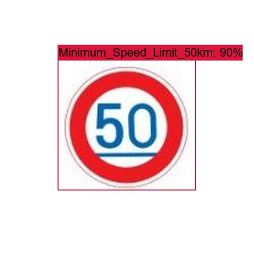</td>
    <td>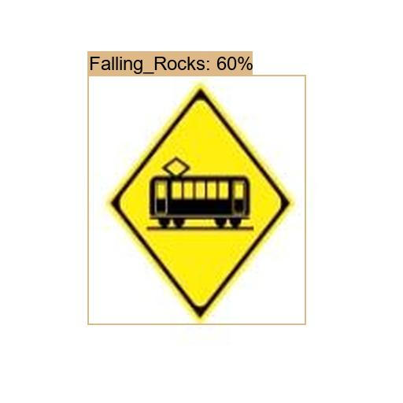</td></tr>

<tr><td></td>
    <td>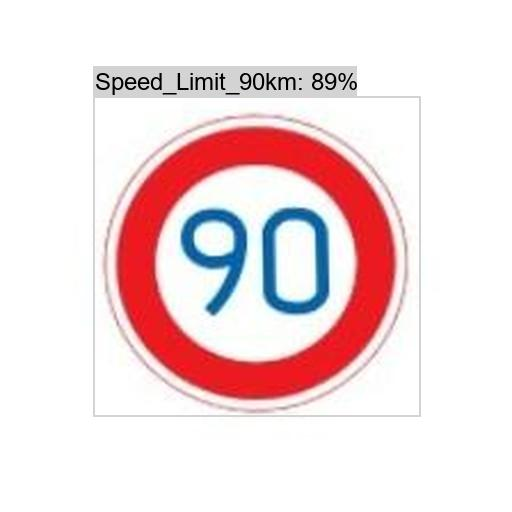</td></tr>

<tr><td>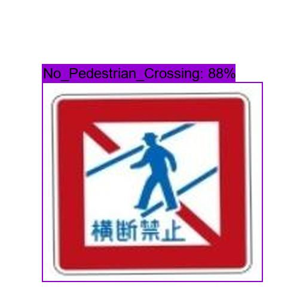</td>
    <td>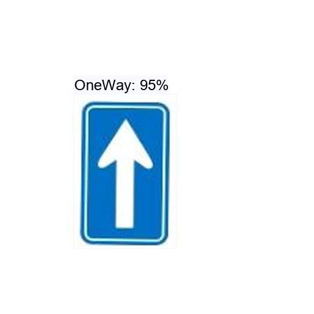</td></tr>

<tr><td>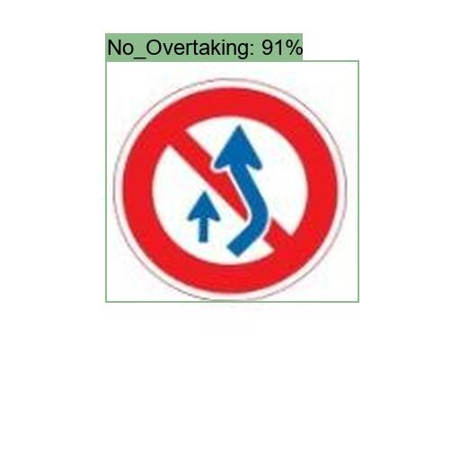</td>
    <td>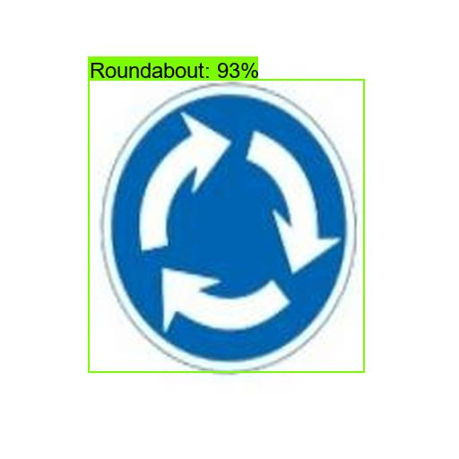</td></tr>

<tr><td>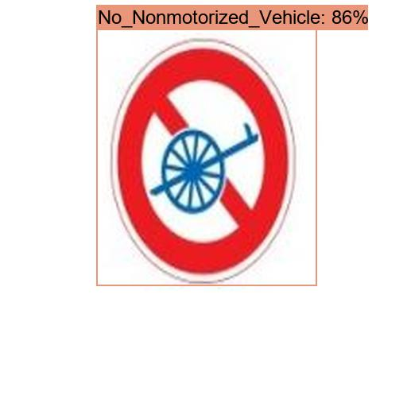</td>
    <td>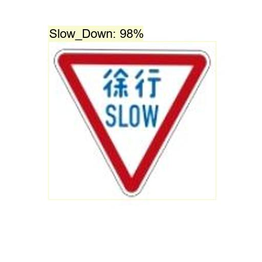</td></tr>

<tr><td></td>
    <td>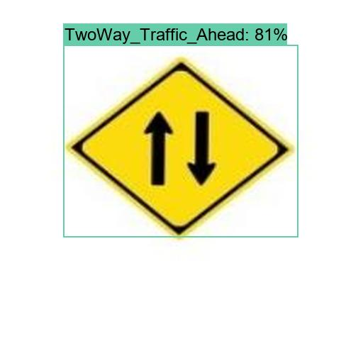</td></tr>

<tr><td>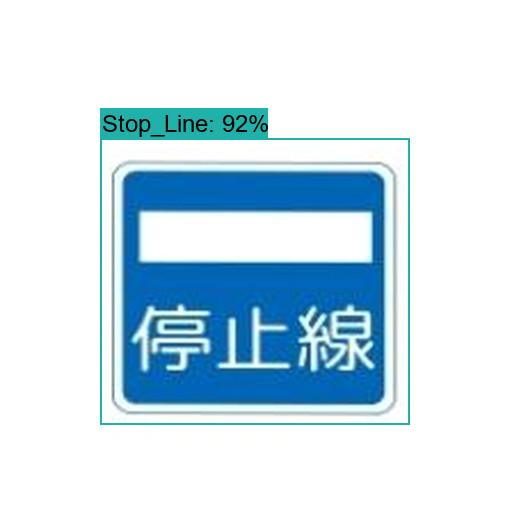</td>
    <td>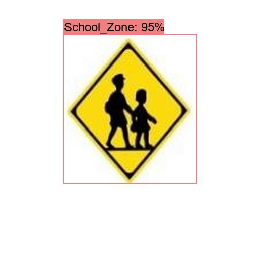</td></tr>

<tr><td>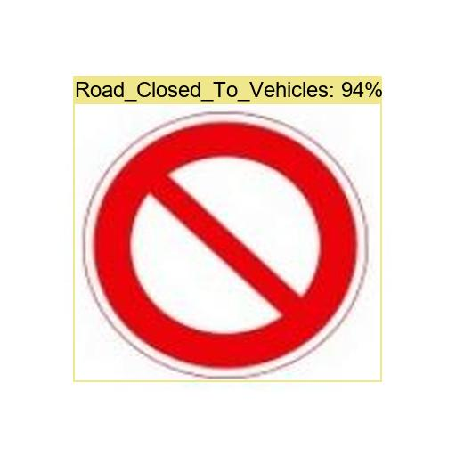</td>
    <td>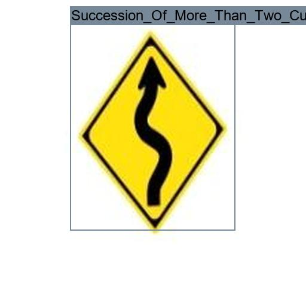</td></tr>

<tr><td>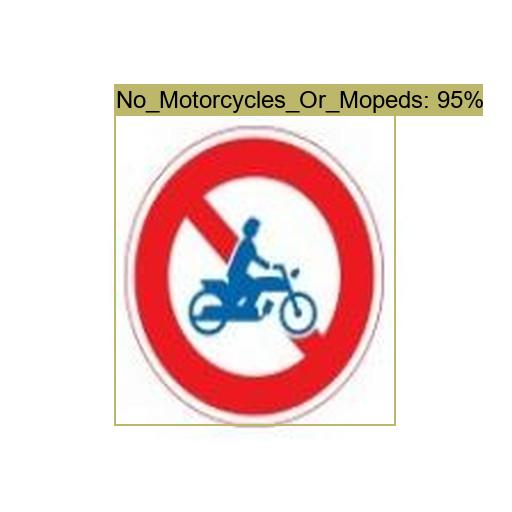</td>
    <td>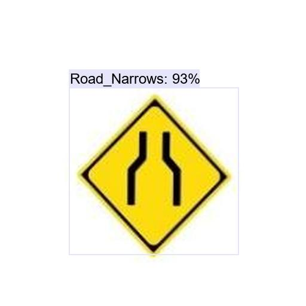</td></tr>

<tr><td></td>
    <td>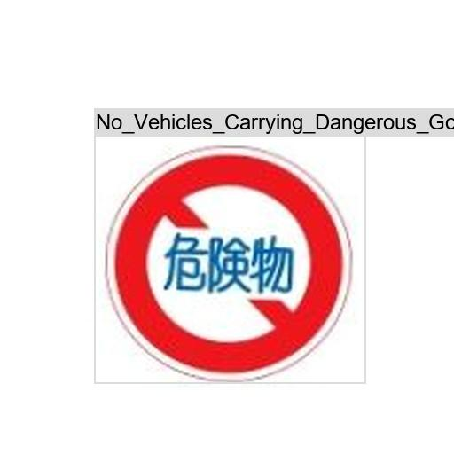</td></tr>

<tr><td>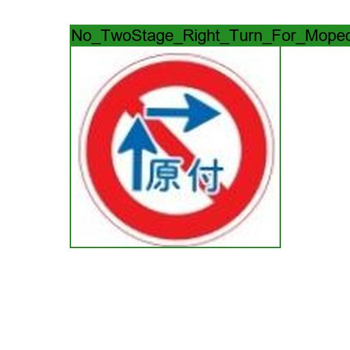</td>
    <td>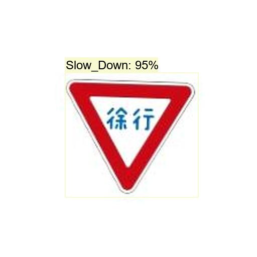</td></tr>

</table>
